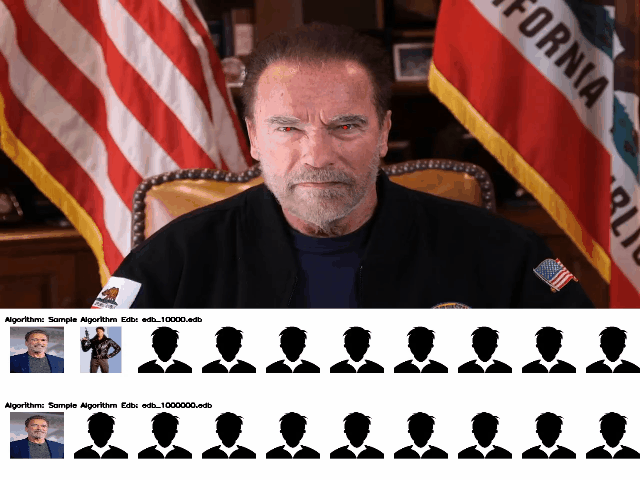

# FRVTMovieMaker
## Purpose
The main purpose of this tool is to visualize the performance of different face recognition algorithms implementing the FRVT 1:N interface using publically available Youtube videos or self-provided video files.
For each algorithm and each background database (edb) a hitlist of size 10 is shown under the video visualizing if one ore more of the reference templates are contained in this list.
## Setup
* Clone the modified frvt repo https://github.com/commanderka/frvt
* Build the projet frvtPlainCWrapper located under /frvt/1N/frvtPlainCWrapper
  * mkdir build
  * cd build
  * cmake ..
  * make
* include the build folder on LD_LIBRARY_PATH
* Add /frvt/1N/frvtPythonWrapper to your PYTHONPATH
* Checkout the frvtMovieMaker repo
* copy the reference implementations you want to benchmark to a folder of your choice and extract them
* copy edbs for each reference implementation to the folder of the implementation. The following naming scheme is required for each edb/manifest:
  * edb name: [edbName].edb
  * manifest name: [edbName].manifest
  * if multiple edb/manifests are found a hitlist is appended for each edb
* Append the lib dir of each reference implementation to your LD_LIBRARY_PATH
* Install python requirements listed in [requirements.txt](requirements.txt) 
* Adapt the file makeMovie.py such that the paths to your reference implementations are correct. Example:
```python
    baseDir = "/frvtMovieMaker"

    #adapt your reference images here
    referenceImagePath1 = "schwarzenegger.jpg"
    referenceImagePath2 = "schwarzenegger2.jpg"

    referenceImagePaths = [referenceImagePath1,referenceImagePath2]

    #choose your own youtube video here
    moviePath = "https://www.youtube.com/watch?v=HvyUnZNE6yc"
    #you can add an arbitrary number of algorithms here. Always make sure that the paths are correct and the edbs are included for each algorithm
    algoInfo1 = AlgorithmInfo("Dermalog008",os.path.join(baseDir,"edbs"),implDir = baseDir,libName = "libfrvt_1N_dermalog_008.so", enrollmentDir=os.path.join(baseDir,"enroll"))
    #gets a list of algorithm infos and a list of reference images
    myMoviemaker = MovieMaker([algoInfo1],referenceImagePaths)
    #creates the movie and writes out the final mp4 file
    myMoviemaker.makeMovie(moviePath) 
```


## Description of the workflow of the script
The script does the following:
1. Templates and eye positions are extracted for each reference algorithm using multiprocessing
2. For each algorithm and edb a hitlist is generated for each movie frame and appended to this frame
3. An mp4 movie is generated from the frames with the appended hitlists
### Docker Image
* https://hub.docker.com/r/commanderka/frvtmoviemaker
The docker image simplifies the installation process. It is based on Centos8.
The only thing to be done is to copy the algorithms/edbs into the docker container and adapt the paths.
## Sample Result
### Reference images used
The following images were used as reference images:
<p float="left">


</p>


### Sample Movies
[](https://youtu.be/2dqpQK0V2HM)


A generated movie using the latest DERMALOG algorithm and two different edbs (containg templates of random celebrities) can be found under sampleMovies.

## Further work
* Add additional screens for a brief performance overview of the algorithms


